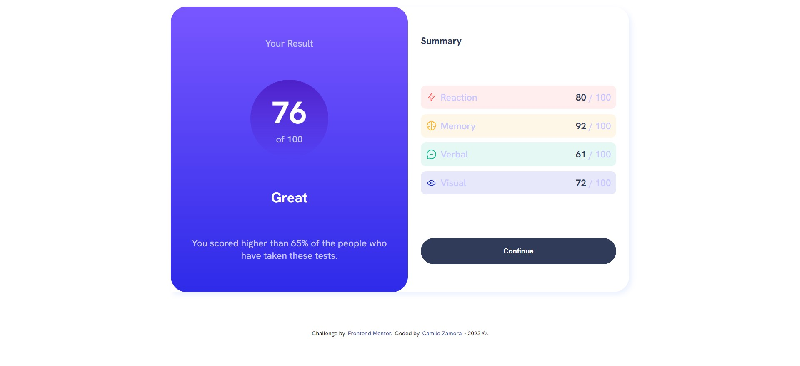

# Frontend Mentor - Results summary component solution

This is a solution to the [Results summary component challenge on Frontend Mentor](https://www.frontendmentor.io/challenges/results-summary-component-CE_K6s0maV). Frontend Mentor challenges help you improve your coding skills by building realistic projects. 

## Table of contents

- [Overview](#overview)
  - [The challenge](#the-challenge)
  - [Screenshot](#screenshot)
  - [Links](#links)
- [My process](#my-process)
  - [Built with](#built-with)
  - [What I learned](#what-i-learned)
  - [Continued development](#continued-development)
  - [Useful resources](#useful-resources)
- [Author](#author)

## Overview

### The challenge

Users should be able to:

- View the optimal layout for the interface depending on their device's screen size
- See hover and focus states for all interactive elements on the page
- **Bonus**: Use the local JSON data to dynamically populate the content

### Screenshot


This is a screenshot of the actual project.
### Links

- Solution URL: [Add solution URL here](https://github.com/CamiloZamora/Results-Summary)
- Live Site URL: [Add live site URL here](https://camilozamora.github.io/Results-Summary/)

## My process

### Built with

- Semantic HTML5 markup
- CSS custom properties
- Flexbox
- CSS Grid
- JavaScript

### What I learned

I practice more CSS features adding hover effects and creating this design. Learn how to use JS and JSON to display data in HTML for more dynamic page.

```js
fetch('data.json')
.then(function (response) {
    return response.json();
})
.then(function (data){
    for(var i = 0; i < data.length; i++){
        document.getElementById("container").innerHTML += `
        <div class="${data[i].category.toLowerCase()} box">
            <div>
                
                <div class="category">${data[i].category}</div>
            </div>
            <div class="points"> <span class="score">${data[i].score}</span> / 100</div>
            </div>
        `
    }    
}) 
.catch(function(err) {
    console.log(err);
});
```
### Continued development

Definitively must practice CSS. I think is very important to study JS and JSON due to these add really huge improvements to Web Pages making it possible to use APIs and use current data.

### Useful resources

- [W3Schools](https://www.w3schools.com/default.asp) - This site has tons of information regarding pretty much everything.
- [MDN web docs](https://developer.mozilla.org/en-US/) - This site has detailed samples, definitions and exercises to understand each concept.

## Author

- Website - [Camilo Zamroa]
- Frontend Mentor - [@CamiloZamora](https://www.frontendmentor.io/profile/CamiloZamora)
- GitHub - [@CamiloZamora](https://github.com/CamiloZamora)
